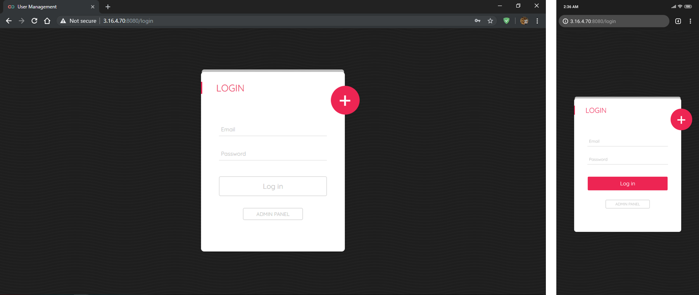
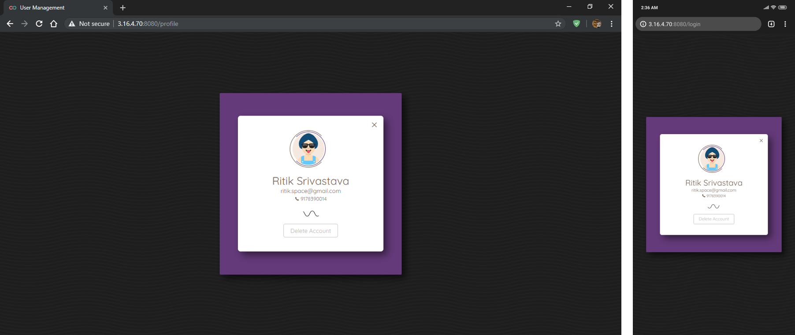
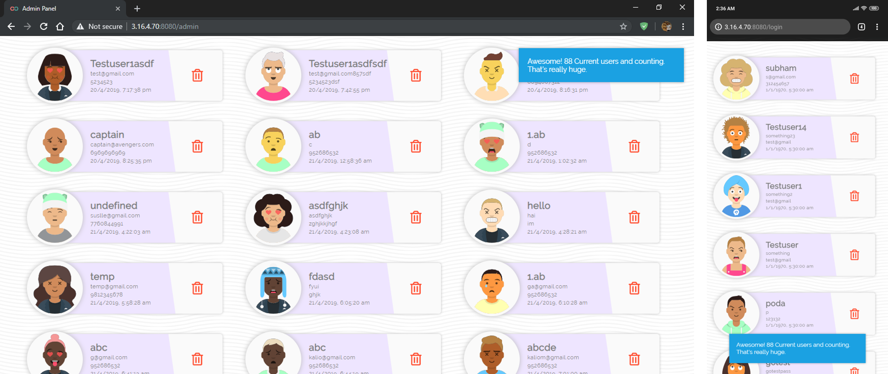

# User Management

**User management** describes the ability for administrators to manage user access to various IT resources like systems, devices, applications, storage systems, networks and more. **User management** is a core part to any directory service and is a basic security essential for any organization. **User management** enables admins to control user access and **on-board** and **off-board** users to and from IT resources. Subsequently a directory service will then **authenticate**, **authorize**, and **audit user access** to IT resources based on what the **IT admin** had dictated.

## Roles and App Permissions
**Organization users** can be assigned one of two roles: **Admin** or **Member**. An organization can have any number of each role, but must have at least one **admin user**. In addition to their member role in the **organization**, **members** can be assigned app permissions on specific **apps** owned by the organization.

### Administrator
+ **Admin** after successful login, gains access to the **Admin Dashboard**.
+ **Admin Dashboard** contains a list of all user in a card like representation.
+ **Every** user card represents:
  - *Dyncamic Avatar*
  - *Username*
  - *Email Address*
  - *Phone Number*
  - *Timestamp of user creation*
+ **Admin** can remove **member access** of user by deleting their **account**.
+ **Admin** can view total **number of users** having a valid **member access**.

### Member
+ **Members** after successful login, gains access to the **User Dashboard**.
+ **Features** provided in **User Dashboard**:
  - View user's profile.
  - Edit user's profile.
  - End user's **membership** by deleting their **account**.

## About This Application
This package provides complete **User Management** solution, packed inside a **fully responsive web application**, posing exceptional user interface with smooth animations. This **web application** is served by a NodeJS Server deployed on **Amazon Web Services EC2 Machine** allocated with a public **IP address**.

## Features
- **User Dashboard** for members to manage their **account**.
- **Admin Dashboard** for administrators to manage all **user accounts** at once.
- **Exceptional user interface** to keep you **enchanted** while browsing through panel.
- **Smooth animations** at every step.
- **Validation** at every step.
- **Notifications** at every **success** step.
- **Error detection** and **handling** at every step.

### Technologies used to serve the purpose:
- NodeJS
- ExpressJS
- SQL Database
- EJS View Engine
- HTML
- CSS
- Javascript

### Libraries Used:
- [JQuery v3.4.0](https://jquery.com/)
- [Sweet Alerts v2.0](https://sweetalert2.github.io/)
- [Noty v2.0](https://ned.im/noty/v2/)
- [Dicebear Avatars](https://avatars.dicebear.com/)
- [Simple Git](https://www.npmjs.com/package/simple-git/)

## API Endpoints

### GET /git
- **git.add('.')** : Adds all files to the commit stack   (*Except .gitignore files*).
- **git.commit(msg)** : Commits the changes with a message   (*-m = msg*).
- **git.push('master', 'master')** : Pushes all local commits to github   (*remote, branch[options]*).

---

### GET /login
- **Renders** the ejs file in views directory (*index.ejs with **login code = 0***).
- **Sends** rendered data to the browser.

---

### GET /*
- **Redirects** all undefined **Get routes** to the **Get /login**.

---

### POST /login
- **Saves** the **Email** and **Password** from the body of request to **variables**.
- **Request** the SQL Database to return the **Password** of the requested **Email Address**.
```
SELECT password FROM userData WHERE emailId = "email@domain.com"
```
- If the **returned array** is empty, it means **no account** with that Email Exists.
> **User** is notified at the front end about **No such account**.

- If the **returned array** is valid, and password doesn't matches the **given password**.
> **User** is notified at the front end about **Incorrect Password**.

- If the **returned array** is valid, and password matches the **given password**.
> - **User** is notified at the front end about **Login Successful**.  
> - **POST /profile** is called at the frontend.

---

### POST /profile
- **Saves** the **Email** and **Password** from the body of request to **variables**.
- **Request** the SQL Database to return the **The User Data** of the requested **Email Address**.
```
SELECT * FROM userData WHERE emailId = "email@domain.com"
```
- **Renders** the ejs file in views directory (*index.ejs with **login code = 1** and **The User Data***).

---

### POST /signup
- **Saves** the **Data** from the body of request to **variables**.
```
var userdata = {
        userName: req.body.username,
        emailId: req.body.email,
        password: req.body.pass,
        phoneNo: req.body.ph,
        dateTime: new Date()            //Returns the current TimeStamp
    };     
```
- **Request** the SQL Database to return the **Password** of the requested **Email Address**.
```
SELECT password FROM userData WHERE emailId = "email@domain.com"
```
- If the **returned array** is valid.
> **User** is notified at the front end about **An account with same email already exist**.  
- If the **returned array** is empty, SQL Database is requested to insert new **set of values** in the table **userData**.
```
"INSERT INTO userData SET ?", userdata
```
- After **Successful Insertion** of account or on some **Error**.
> **User** is notified at the front end.

---

### POST /delete
- **Saves** the **Email** and **Password** from the body of request to **variables**.
- **Request** the SQL Database to return the **Password** of the requested **Email Address**.
```
SELECT password FROM userData WHERE emailId = "email@domain.com"
```
- If the **returned array** is valid, and password matches the **given password**.
- **Request** the SQL Database to delete the **The User Data** of the requested **Email Address**.
```
DELETE FROM userData WHERE emailId = "email@domain.com"
```
- After **Successful Deletion** of account or on some **Error**.
> **User** is notified at the front end.

---

### POST /admin
- **Renders** the ejs file in views directory (*admin.ejs*).
- **Sends** rendered data to the browser.

---

## Screenshots

### Login Page


---

### Profile Page


---

### Admin Panel


---
  
## Try Your Hands Now
**This Web Application** is fully fabricated and ready to be tested. **Go ahead** give it a try.  

[](http://3.16.4.70:8080)
